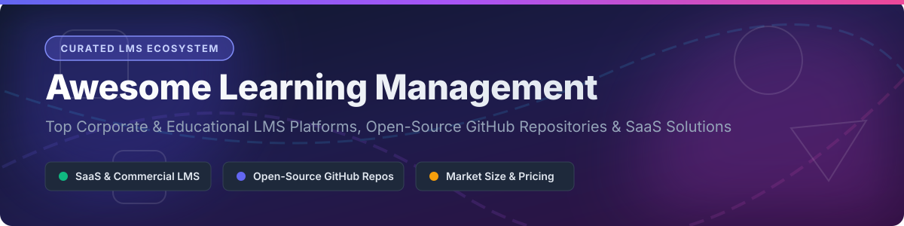

# 🎓 Awesome Learning Management Systems (LMS) 🚀

## 🌐 Top Learning Management System (LMS) Platforms & Open-Source Ecosystem 📚

> **Comprehensive Curated List of Commercial SaaS Products, Enterprise Training Platforms & Open-Source GitHub Repositories**  
> *Empowering Corporate L&D, Online Course Creators, Higher Education, Compliance Training & Employee Onboarding.*

---

## 📑 Table of Contents 

- [📊 Market Overview & Industry Intelligence](#-market-overview--industry-intelligence)
- [💼 SaaS & Commercial LMS Platforms](#-saas--commercial-lms-platforms)
- [🔓 Open-Source GitHub LMS Projects](#-open-source-github-lms-projects)
- [🛠️ Architecture & Implementation Frameworks](#%EF%B8%8F-architecture--implementation-frameworks)
- [🤝 How to Contribute](#-how-to-contribute)
- [💖 Support & Sponsorship](#-support--sponsorship)
- [📈 Star History](#-star-history)
- [⚠️ Disclaimer](#%EF%B8%8F-disclaimer)

---

## 📊 Market Overview & Industry Intelligence 📈

> [!NOTE]
> **Market Size & Fragmentation**: The global Learning Management System (LMS) market is estimated at **$22.1 Billion (2024)** and is projected to surpass **$69.7 Billion by 2030** (CAGR ~18.6%). The sector is **moderately fragmented**: higher education and enterprise segments are anchored by major incumbents (Instructure, Canvas, Workday Learning, Docebo, Cornerstone), while the creator and SMB space features vibrant competition (Kajabi, Thinkific, Teachable) alongside deeply rooted open-source platforms (Moodle, Open edX).

---

## 💼 SaaS & Commercial LMS Platforms 🏢

The table below details commercial LMS solutions, sorted descending by estimated company revenue / market valuation.

| 🏢 Platform | 💰 Company Valuation / Revenue | 🏷️ Paid Tier Starting Price | 🎁 Free Tier / Free Trial Limits | 🌟 Core Focus & Strengths |
| :--- | :--- | :--- | :--- | :--- |
| **[Canvas LMS (Instructure)](https://www.instructure.com/canvas)** | **~$4.8 Billion** *(Publicly Acquired / Market Cap)* | $10.00 / user / year (Enterprise quotes) | **Free For Teacher Plan** (Forever free account for individual educators with core course creation & quiz tools) | Industry standard in K-12 & Higher Ed with modern UX and deep LTI tool integration. |
| **[Docebo](https://www.docebo.com/)** | **~$1.6 Billion** *(Public Market Cap / ~$200M ARR)* | $25,000 / year (Enterprise base tier) | **14-Day Free Trial** (Full enterprise features access for up to 30 active users; no credit card required) | AI-driven enterprise learning platform with automated content tagging and deep HRIS integrations. |
| **[Kajabi](https://kajabi.com/)** | **~$2.0 Billion** *(Valuation / ~$100M ARR)* | $149.00 / month (Basic plan billed annually) | **14-Day Free Trial** (Full access to 1 product, 1 funnel, up to 10,000 contacts & 1,000 active members) | All-in-one knowledge commerce system combining courses, sales funnels, email marketing, and membership sites. |
| **[Litmos (SAP)](https://www.litmos.com/)** | **~$1.0 Billion** *(Acquisition Value)* | $6.00 / user / month (Pro plan min 100 users) | **14-Day Free Trial** (Unrestricted platform feature testing for corporate L&D administrators) | Enterprise corporate training LMS focused on rapid compliance deployment and off-the-shelf course catalogs. |
| **[Thinkific](https://www.thinkific.com/)** | **~$250 Million** *(Public Market Cap / ~$60M ARR)* | $36.00 / month (Basic plan billed annually) | **Free Plan Available** (1 course, 1 administrator, unlimited students, 0% transaction fee) | Solopreneur and business course creator platform for building, marketing, and monetizing learning products. |
| **[Absorb LMS](https://www.absorblms.com/)** | **~$500 Million** *(Welsh Carson Acquisition)* | $12,500 / year (Base licensing + setup) | **14-Day Free Trial** (Sandbox demo environment with pre-loaded sample courses & reporting suite) | Corporate LMS designed for employee onboarding, compliance, external partner, and customer training. |
| **[Teachable](https://teachable.com/)** | **~$250 Million** *(Acquired by Hotmart)* | $39.00 / month (Basic plan + 5% transaction fee) | **Free Plan Available** (1 published course, 1 admin seat, up to 10 students, $1 + 10% transaction fee) | Accessible course creation platform for digital entrepreneurs with integrated payment processing. |
| **[LearnUpon](https://www.learnupon.com/)** | **~$150 Million** *(Valuation / ~$30M ARR)* | $1,299.00 / month (Essential plan up to 500 users) | **14-Day Free Trial** (Custom portal sandbox testing for training managers and enterprise teams) | Scalable multi-tenant LMS for enterprise businesses training internal staff, channels, and customers. |
| **[TalentLMS](https://www.talentlms.com/)** | **~$100 Million** *(Estimated Private Valuation)* | $69.00 / month (Starter plan billed annually) | **Free Plan Available** (Forever free for up to 5 users, 10 courses, unlimited storage) | User-friendly, fast-to-deploy LMS popular with SMBs for gamification, quizzes, and quick onboarding. |
| **[MoodleCloud](https://moodle.com/)** | **~$50 Million** *(Moodle HQ Ecosystem)* | $130.00 / year (Starter plan up to 50 users) | **28-Day Free Trial** (Fully hosted Moodle instance with up to 50 users and 250 MB file storage) | Official managed cloud hosting solution for Moodle, eliminating self-hosting overhead for small institutions. |

---

## 🔓 Open-Source GitHub LMS Projects 💻

Open-source learning management systems offer full data sovereignty, zero licensing fees, and infinite customization. Sorted descending by GitHub star count.

| 📦 Repository & Project | 🌟 GitHub Stars | 📜 License | 🧰 Tech Stack | 💡 Overview & Primary Use Case |
| :--- | :--- | :--- | :--- | :--- |
| **[openedx/edx-platform](https://github.com/openedx/edx-platform)** |  | AGPL-3.0 | Python / Django / React | Powered edX.org; massive scale platform built for MOOCs, universities, and multi-tenant national learning initiatives. |
| **[moodle/moodle](https://github.com/moodle/moodle)** |  | GPL-3.0 | PHP / MySQL / Postgres | World's most popular open-source LMS with thousands of community plugins, extensive assessment tools, and mobile app support. |
| **[instructure/canvas-lms](https://github.com/instructure/canvas-lms)** |  | AGPL-3.0 | Ruby on Rails / React | Open-core repository powering Instructure Canvas; ideal for self-hosted higher-ed and institutional learning. |
| **[frappe/lms](https://github.com/frappe/lms)** |  | GPL-3.0 | Python / Frappe / Vue | Modern, easy-to-use 100% open-source LMS built on the Frappe framework with built-in portal and course creator. |
| **[sakaiproject/sakai](https://github.com/sakaiproject/sakai)** |  | ECL-2.0 | Java / Spring / JS | Academic collaboration and learning environment developed by a higher-ed university consortium. |
| **[overhangio/tutor](https://github.com/overhangio/tutor)** |  | AGPL-3.0 | Python / Docker | Official Docker-based deployment & maintenance tool for Open edX, greatly simplifying installation and ops. |
| **[chamilo/chamilo-lms](https://github.com/chamilo/chamilo-lms)** |  | GPL-3.0 | PHP / Symfony | Lightweight, user-friendly LMS focused on low hardware overhead, WCAG accessibility, and ease of course publishing. |
| **[Automattic/sensei](https://github.com/Automattic/sensei)** |  | GPL-2.0 | PHP / WordPress | Official WordPress LMS plugin by Automattic for seamlessly converting WordPress sites into learning platforms. |
| **[ILIAS-eLearning/ILIAS](https://github.com/ILIAS-eLearning/ILIAS)** |  | GPL-3.0 | PHP / MySQL | Enterprise-ready open-source LMS widely adopted across European universities, militaries, and public sector agencies. |
| **[OpenOLAT/OpenOLAT](https://github.com/OpenOLAT/OpenOLAT)** |  | Apache-2.0 | Java / Spring | Swiss-engineered LMS for sophisticated higher-education e-learning, exam auditing, and collaborative learning. |
| **[claroline/Claroline](https://github.com/claroline/Claroline)** |  | GPL-3.0 | PHP / Symfony | Collaborative e-learning and e-working platform providing flexible pedagogical learning path tools. |
| **[formalms/formalms](https://github.com/formalms/formalms)** |  | GPL-2.0 | PHP / MySQL | Open-source corporate LMS tailored specifically for business training, skills management, and HR reporting. |

---

## 🛠️ Architecture & Implementation Frameworks 🏗️

> [!TIP]
> **Choosing the Right LMS Strategy:**
> - **Self-Hosted Open Source (Moodle / Open edX / Canvas)**: Best for universities, government agencies, and tech-enabled corporations prioritizing total data privacy, custom SCORM/xAPI workflows, and zero seat-licensing fees.
> - **SaaS Solutions (Docebo / Absorb / TalentLMS)**: Ideal for rapid deployment in corporate L&D, compliance enforcement, and turnkey HRIS/SSO integrations without maintaining infrastructure.
> - **Creator Platforms (Kajabi / Thinkific / Teachable)**: Optimal for independent instructors, course entrepreneurs, and digital product sales requiring built-in marketing funnels and checkout systems.

---

## 🤝 How to Contribute 📑

Contributions to keep this repository up to date are highly appreciated! 

1. **Fork** the repository 🍴
2. **Add or update** your platform or open-source repo in `README.md` following table formatting.
3. Ensure description links to official websites or GitHub repositories.
4. **Submit a Pull Request** with a clear explanation of the changes 🚀

---

## 💖 Support & Sponsorship ☕

If you find this curated LMS repository helpful for your organization, institution, or project, please consider supporting the maintenance of this project!

- ⭐ **Star** this repository to increase its visibility.
- 🍴 **Fork** and contribute your own platform findings or fixes.
- 📢 **Share** this list with fellow instructional designers, developers, and L&D managers.
- ☕ **Buy me a coffee / Sponsor**: You can support ongoing open-source curation via the [GitHub Sponsor Dashboard](https://github.com/sponsors/ishandutta2007).

---

## 📈 Star History

---

## ⚠️ Disclaimer ⚖️

- This directory is a **community-curated index** provided for informational and research purposes.
- Market valuations, revenue numbers, and pricing tiers reflect estimated public and reported data as of 2026 and are subject to change.
- Self-hosting open-source learning platforms requires appropriate security hardening, data protection (GDPR/FERPA), and accessibility compliance (WCAG).

---

  <b>Made with ❤️ for L&D professionals, instructional designers, university administrators, and software engineers worldwide.</b>

